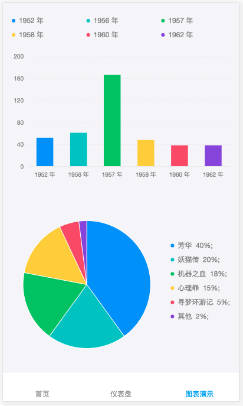

# antd-mobile-dva-f2

Ant Mobile 2 + Dva2 + Roadhog2 + F2

基于 [dva-antd-mobile-starter](https://github.com/xlsdg/dva-antd-mobile-starter)，主要将Roadhog升级到了2.3.0，并参照 [g2-react](https://github.com/antvis/g2-react) 简单封装了一个F2图表组件以便在React中使用。

# 工程说明
1. 参照Antd Pro工程进行了一些优化，并将`request`组件移植过来。
2. 增加了图表的mock数据，以结合dva和F2图表进行数据演示。
3. 封装的F2图表组件`F2React`，默认支持宽度自适应。

# 图表使用
* 目前基于已封装的`F2React`组件，初步封装了基本柱图、双柱图、基本饼图3个组件，可自行根据需求进一步封装。
* 仪表盘（`routes`下的`Dashboard`）为结合DVA使用的例子。
* 图表演示（`routes`下的`ChartDemo`）为纯静态数据的例子。

```
import BarDodge from '../../components/Charts/Bar/dodge';
```

```
<BarDodge
  data={barDodgeData}
  // width={360} // 不设置宽度则宽度自适应父容器
  height={360} // 需根据实际需要设置高度
  padding={30} // 可传入padding给F2React组件
  // configs={{}} // 需要传入给F2React组件的一些配置
/>
```



# TODO
* F2React独立为npm组件
* 常用图表组件封装
* Dva loading的处理
* ...
